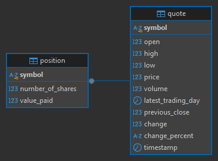

# Introduction
The Stock Quote App is a command-line application that allows users to manage a simulated stock portfolio 
by retrieving real-time stock data, viewing their positions, and executing buy and sell transactions.
It utilizes the Alpha Vantage API to fetch live stock information and maintains portfolio 
data using a PostgreSQL database. The app ensures data persistence and retrieval through JDBC, with
logging handled via Log4j for tracking application flow and errors. Designed with modularity in mind,
it consists of a layered architecture and supports integration testing.

# Technologies
- Java
- Maven
- JDBC
- DAO Pattern
- PostgreSQL
- JUnit
- Mockito
- Jackson JSON Parser
- okhttp3 
- Alpha Vantage API
- Log4j
- Docker

# Quick Start
To use the application, Java 11+, Maven, and Docker (PostgreSQL database) are required. 

### Set up the PostgreSQL database
1. Pull Docker Image
`docker pull postgres`

2. Build the data directory
`mkdir -p ~/srv/postgres`

3. Run docker image
`docker run --rm --name stockquote -e POSTGRES_PASSWORD=password -d -v $HOME/srv/postgres:/var/lib/postgresql/data -p 5432:5432 postgres`

4. Create the database
`psql -h localhost -U postgres -f sql/database.sql`

5. Insert tables into the database
`psql -h localhost -U postgres -d stock_quote -f sql/stockquote.sql`

6. Configure the properties file in src/main/resources/properties.txt to include your database connection details 

### Building and Running the Application Locally
1. Build the project using
`mvn clean compile`

2. Then run the Main class to start the application

### Running the Application via Docker
1. Alternatively, to run the project using docker, pull the image 
`docker pull neven267/stockquote`

2. Then run the container using
`docker run -it --rm neven267/stockquote`

# Implementation
## ER Diagram

## Design Patterns
The project utilizes the DAO design pattern to separate the data access layer from the business 
logic of the application. The DAO layer handles database interactions with CRUD (create, read, 
update, delete) operations, leaving the business logic to the Service layer of the application.

The Service layer acts as an intermediary between the Controller and DAO, ensuring proper validation
and business logic execution before interacting with the database.

The Controller layer handles user inputs and delegates business logic to the Service layer, bridging
the user commands with the rest of the application. 

The Helper layer consists of files that aid in processing data. The Service layer utilizes the Helper
layer and this is where the Alpha Vantage API calls are made for real-time stock data. 

The Repository Design pattern separates the data access layer from the business logic, similar to 
the DAO design pattern. However, the Repository pattern focuses on providing a high-level 
abstraction for accessing data. A repository will use DAOs to fetch data instead of directly 
interacting with the database.

# Test

## Unit Testing
Unit tests are written using JUnit and Mockito to validate the behaviour of individual components. 
The key areas covered include:
- Service Layer: Verifies that business logic functions correctly, mocking DAO interactions as well 
as Position and Quote objects to isolate tests
- DAO Layer: Ensures database operations (CRUD) behave as expected

## Integration Testing
Integration tests involve actual interaction with the PostgreSQL database to verify end-to-end 
functionality. These tests use valid stock ticker symbols to 
- Retrieve stock data from the API
- Store and query data from the database
- Perform buy/sell transactions and validate updates

To prevent data contamination, a separate test database is used, and transactional rollbacks ensure
tests do not affect other tests and real data.

# Deployment
The application was dockerized as a Docker image, available on DockerHub. The steps to deploying the
image are as follows:
1. Created a dockerfile with commands to set the working directory and copy the packaged jar and 
dependencies into the container
2. Packaged the application using maven to create a jar file
3. Built a new local docker image using the dockerfile
4. Pushed the docker image to DockerHub

# Improvement 
- Provide a user-friendly web-based UI to visualize stock performance.
- Add request limits to prevent API abuse (Alpha Vantage API is limited to five requests per minute)
- Add an account balance to limit how much users can purchase to simulate a real portfolio
