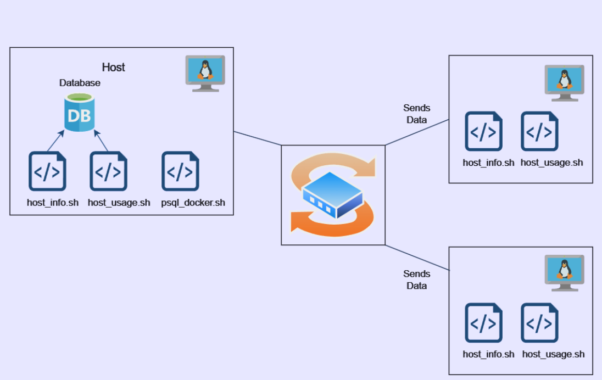

# Linux Cluster Monitoring Agent
## Introduction
This project is an automated solution for system administrators to monitor server performance metrics across a network of Linux servers. It collects hardware specifications as well as resource usage data (e.g. CPU, memory, disk) in real-time and saves it in a relational database management system. This project is built using Bash scripts, Docker, PostgreSQL, Crontab, and Git.
## Quick Start
These steps will explain how to use the Linux Cluster Monitoring Agent
- Start up the psql instance using docker
```
./scripts/psql_docker.sh start
```
- Create the database tables
```
psql -h localhost -U postgres -d host_agent -f sql/ddl.sql
```
- Insert hardware specifications into the DB
```
bash scripts/host_info.sh localhost 5432 host_agent postgres password
```
- Insert hardware usage data into the DB
```
bash scripts/host_usage.sh localhost 5432 host_agent postgres password
```
- Crontab setup to automate data insertion
```
# edit crontab jobs
crontab -e

# add host_usage.sh to crontab
* * * * * bash [/path_to_host_usage/host_usage.sh] localhost 5432 host_agent postgres password > /tmp/host_usage.log
```
## Implementation 
This project uses Docker, Bash scripts, PostgreSQL, Crontab, and Git to build a reliable Linux cluster monitoring system. Docker is employed to containerize the PostgreSQL database, making it easy to deploy and manage. Bash scripts are used to collect system information from each host which is then stored on the PostgreSQL database. Crontab schedules periodic data collection to automate the data collection process. Git is used for version control, enabling collaborative development and easy tracking of changes. 
### Architecture
 

### Scripts 
- psql_docker.sh starts, stops, or creates a docker container 
```
./scripts/psql_docker.sh start|stop|create [db_username][db_password]
```
- host_info.sh collects hardware specifications and inserts them into the database
```
# Script usage
bash scripts/host_info.sh psql_host psql_port db_name psql_user psql_password

# Example
bash scripts/host_info.sh localhost 5432 host_agent postgres password
```
- host_usage collects server resource usage data and inserts them into the database
```
# Script usage
bash scripts/host_usage.sh psql_host psql_port db_name psql_user psql_password

# Example
bash scripts/host_usage.sh localhost 5432 host_agent postgres password
```
- crontab automates the execution of host_usage.sh at specified intervals (1 minute)
```
# edit crontab jobs
crontab -e

# add this to crontab
* * * * * bash [/path_to_host_usage/host_usage.sh] localhost 5432 host_agent postgres password > /tmp/host_usage.log

# list crontab jobs
crontab -l
```
### Database Modeling
host_info table
| Column | Datatype | 
|--------|----------|
| id | SERIAL |
| hostname | VARCHAR |
| cpu_number | INT2 |
| cpu_architecture | VARCHAR |
| cpu_model | VARCHAR | 
| cpu_mhz | FLOAT8 | 
| l2_cache | INT4 | 
| "timestamp" | TIMESTAMP | 
| total_mem | INT4 |

host_usage table
| Column | Datatype | 
|--------|----------|
| "timestamp" | TIMESTAMP|
| host_id | SERIAL |
| memory_free | INT4 | 
| cpu_idle | INT2 | 
| cpu_kernel | INT2 | 
| disk_io | INT4 | 
| disk_available | INT 4 |

## Test
- bash scripts were tested using debug mode by using the -x option
```
bash -x ./scripts/psql_docker.sh
```
- host_info and host_usage data were compared with the data from the commands:
  - lscpu
  - vmstat
  - /proc/cpuinfo
- ddl.sql script was tested by checking if the tables were created in the database and inserting sample data

## Deployment
The application was deployed using crontab and ensuring that the host_usage.sh script had execute permissions with the command
```
chmod +x
```
Crontab allows the script to be executed automatically at a set schedule which can be specified. 

## Improvements
- Data Visualization for real-time monitoring metrics stored in the database
- Alert System to notify users when resource usage exceeds a set threshold
- Adding more advanced metrics such as network latency
